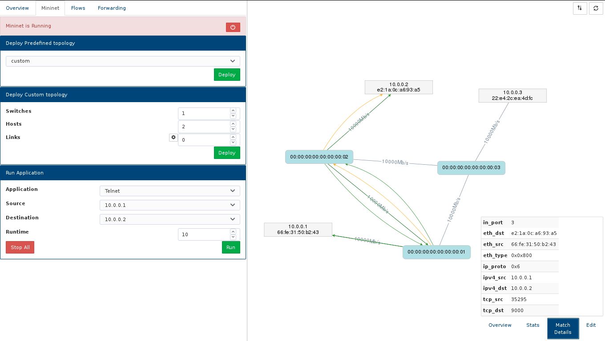

# SimpleSDN
A browser-based application for interacting with OpenFlow-enabled networks. 

Allows sample networks to be created and deployed using [Mininet](http://mininet.org).

Visualise and interact with OpenFlow networks through an SDN controller - currently uses a modified version of [Floodlight](http://www.projectfloodlight.org/floodlight/).
