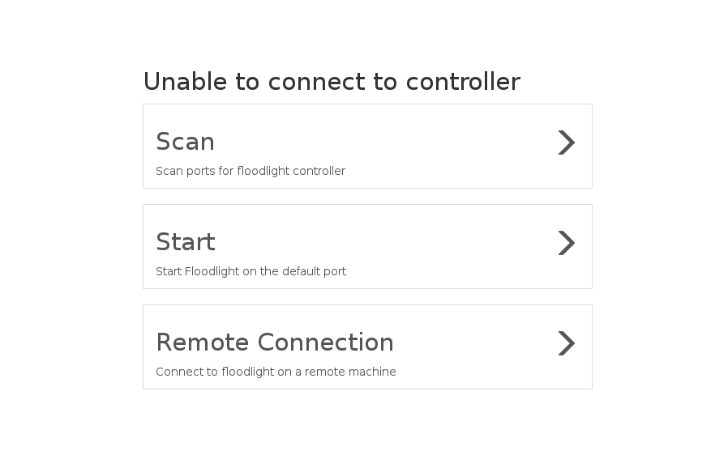
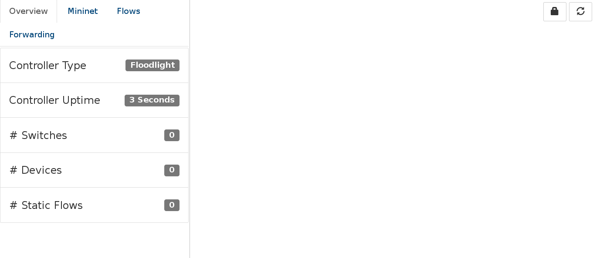
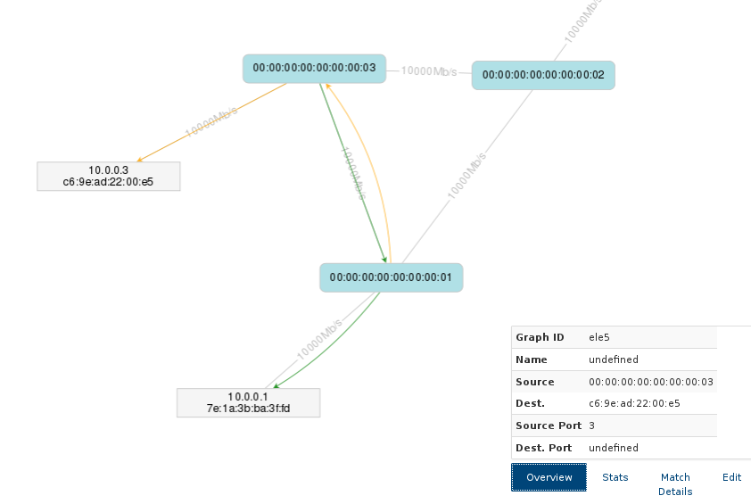
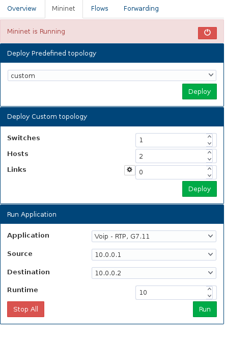
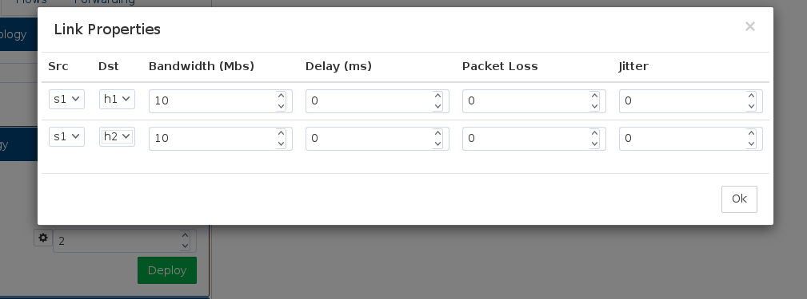
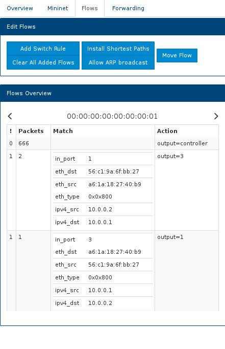
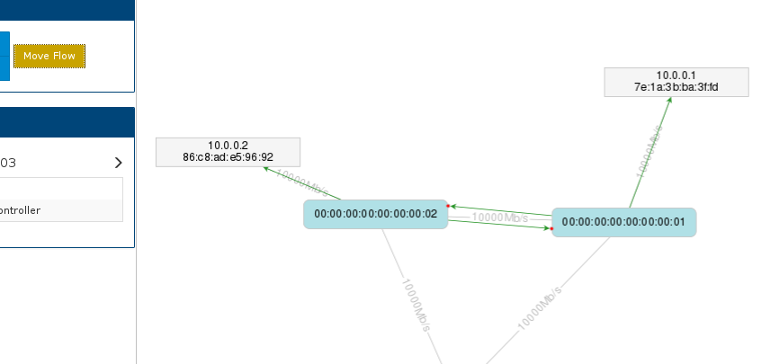
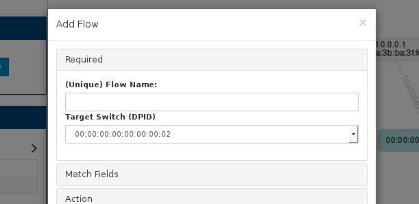
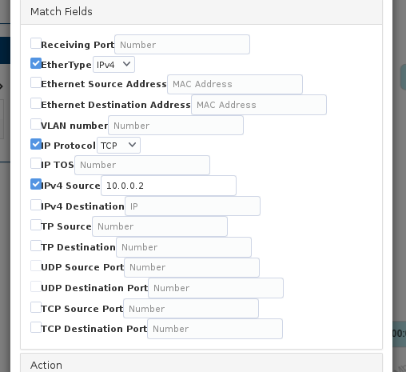
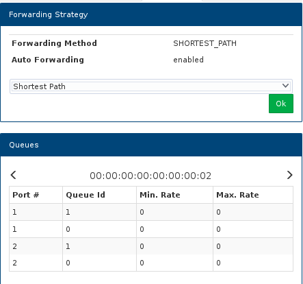

#User Guide

##Setup Screen
When the web server is running, the web application will try to automatically connect to the default location of Floodlight. This is defined in “../web-app/application/config/config.php”.
If Floodlight is not found to be running at the default location (IP & port) you are provided with 3 options:

1. Check if Floodlight is running on any ports on the server
2. Start Floodlight using the default configuration
3. Connect to an instance of Floodlight running somewhere else
    * In this case a pop-up provides the ability to define the IP (in relation to the server) & port

    
    
## Connection Established
Once a connection to Floodlight has been established, you will be presented with the following interface:

    
The user interface is split into 2 main parts – the side panel on the left and the network viewer on the right. 
The side panel consists of a number of tabs:
1. Overview	(as can be seen in above image)
2. Mininet
    * This tab contains Mininet related functionality
    * The tab can be disabled/hidden using the 'allow_mininet' setting in the configuration file (“../web-app/application/config/config.php”)
3. Flows
    * Contains all things related to network flows
    * Provides an overview of defined flows per switch	
    * Provides buttons that allow flows to be added, edited or removed
4. Forwarding
    * Allows forwarding strategy to be set 
    * Outlines any available Queues per switch

In the top right corner are 2 buttons – one refreshes the graph, the other locks the state of the graph.

## Graph Interaction
Flows are grouped together per-link by default.

A Right-click on a flow will result in flows along a link to expand and collapse.

These flows can be individually inspected – on left-click, flows with the same match fields are highlighted so that traffic paths can be easily identified. A pop-up box also appears in the bottom right corner. This pop-up box outlines information about the flow, such as the source and destination, the specified match fields and the number of packets that have been detected (not updated in real time).  

If a flow has been automatically added by the controller, the flow can be made permanent under the edit tab of the pop-up box (using the '+' button). This will allow the flow to be edited.

If a flow is permanent, the edit tab will allow the user to remove or edit the rules for the flow.
Clicking on edit will open up the 'Add Switch Rule' pop-over with the fields pre-populated.
(This can be useful for replicating a rule for multiple switches – change the name, change the switch and adjust the output port if need be).

Note: Hosts may “disappear” from the graph – this happens when the host has become inactive for a certain length of time, and thus the controller removes the host from it's view of the network. 
The IP addresses may not appear on hosts until they have sent traffic (may require you to refresh the graph).

##Mininet

The Mininet tab provides a number of features. 
If the Mininet server is detected, the user is able to turn off the running instance with the 'off' button.
A range of topologies can be selected from to deploy.

    
A user can alternatively define their own topology by specifying the number of switches, hosts and links.
A 'settings' button, when pressed, provides the user with options for setting the links between the switches and hosts.

Application traffic can be run between 2 hosts for a specified length of time.
Note: Ping ignores runtime option.
Pingall ignores specified hosts, and attempts to send a ping between all hosts.

##Flows Tab
The Flows tab has a number of buttons which provide different functions. 

'Install Shortest Paths' and 'Allow ARP broadcast' are used to demonstrate multiple flow definitions being pushed to each switch. 

'Clear All Added Flows' removes all flow rules that have been defined.

'Add Switch rule' can be used to add and edit flow definitions. This is looked at in more detail further down.

'Move Flow' is also used to edit flow rules by allowing you to drag the flows in the graph. Also looked at in more detail further down.

An overview of flows that are present in the network are outlined per switch, with the ability to toggle through each switch.

The table defines the flow priority (indicating the lookup order when matching a packet to a rule), how many packets have matched to that flow definition, the match fields and the corresponding action.
Note: OpenFlow switches are defined by their DPID (data-path ID).

##Move Flow
The move flow button will allow expanded flows to be redirected using the mouse. When pressed, the graph will be 'locked' (can be unlocked using the button in the top right hand corner). Flows can be moved by dragging the red node to another (connected) device.

    
    
##Add Switch Rule
The 'Add Switch Rule' button allows you to add & edit flow rules.
User-defined flow rules are identified using a name. If no name is added a time-stamp is used. If a name already exists, it is overwritten.

Match Fields allow you to define what packets an action is intended for. 
Simply select the relevant fields and specify the value to be matched to.
Some fields have pre-requisite matches that must be selected first – for example to specify the IPv4 Source, EtherType needs to be selected and set to IPv4.

Under 'Action', Output method and Queues can be specified. 
Output can be a port number or the input can be left empty to drop packets. 'All', 'Flood' and 'Controller' are also valid output options, but these flows are not shown on the graph.
Priority defines the priority of the defined rule. If idle timeout is specified, the rule will be removed after no packets have been matched to it for the specified length of time. Hard timeout removes the rule after the specified length of time. 

##Forwarding

The forwarding tab displays any queues that can be found on switches, as well as allowing the forwarding method to be changed according to approximate network statistics.

